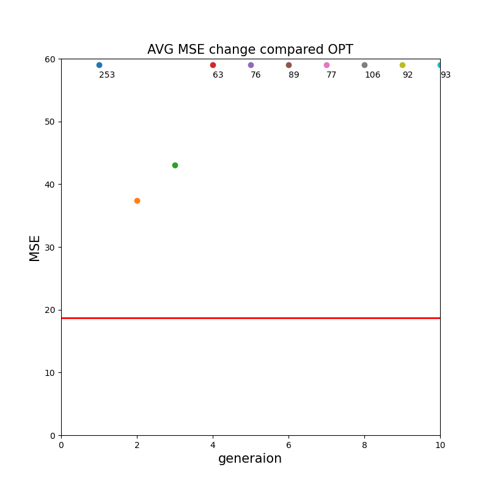

# 유전자 알고리즘을 이용한 회귀식 추정

## **개요**

- 학번: 201701688
- 이름: 윤철중
- 작성일자: 22.06.14

이 글은 인천대학교 2022-1학기 컴퓨터 알고리즘 기말고사 대체 과제를 위해 작성하게 되었습니다. 최적화 알고리즘을 이용하여 회귀식을 추정하는데 유전자 알고리즘(Genetic Algorithm, GA)을 중심으로 살펴보도록 하겠습니다.

## 유전자 알고리즘

유전자 알고리즘(Genetic Algorithm, GA)는 다윈의 진화론으로부터 창안된 해 탐색 알고리즘이다. 즉, ‘적자생존’의 개념을 최적화 문제를 해결하는데 적용한 것이다.

유전자 알고리즘의 과정은 여러 개의 해를 임의로 생성하여 초기 세대로 놓고 반복 과정을 통해세 현재 세대로부터 다음 세대의 해들을 생성해가며 반복 과정이 끝났을 때의 마지막 세대에서는 가장 우수한 해를 리턴하는 것을 목적으로 한다. 현재 세대로부터 다음 세대의 해를 생성할 때는 보다 더 우수한 해를 생성하기 위해 선택 연산, 교차 연산, 돌연변이 연산을 한다.

위 유전자 알고리즘의 과정을 간단히 요약하면 아래와 같다.

1. 초기 세대 생성
2. 현재 세대에 대한 적합도 계산
3. 현재 세대로부터 다음 세대 생성
4. 종료 조건 판별

## 데이터

### 설명

[Students Performance in Exams](https://www.kaggle.com/datasets/spscientist/students-performance-in-exams)

위 데이터는 학생들의 수학, 읽기, 쓰기 과목에서 시험성적을 가지고 있다. 추가 항목으로는 부모의 최종 학력, 시험 준비 유무 등이 있다.

**데이터를 통해 읽기 점수와 쓰기 점수의 상관 관계를 분석**한다. **만약 시험 준비를 한 상태라면 읽기 능력과 쓰기 능력의 관계와 상관없이 암기 능력이 뛰어나서 고득점을 할 수 있다고 판단하여 추가 항목 중에서 시험 준비를 하지 않은 학생들만 추출하여 사용**한다. 이외에 **추가 항목들은 읽기 능력과 쓰기 능력의 관계만을 분석하는데 엄청난 영향을 끼치지 않을 것이라 판단**하여 처리하지 않았다.

### 불러오기

```python
import pandas as pd
```

```python
# StudentsPerformance.csv 파일 불러 오기
pd.set_option('display.max_columns', None)
df = pd.read_csv('./input/StudentsPerformance.csv', encoding='utf-8')
print(df)
```

**파이썬 라이브러리 pandas를 이용**하여 csv파일을 불러온다. 이를 출력하면 다음과 같다.

```
/Users/chuljoong/Desktop/genetic-algorithm/Genetic-Algorithm/venv/bin/python /Users/chuljoong/Desktop/genetic-algorithm/Genetic-Algorithm/GA.py
     gender race/ethnicity parental level of education         lunch  \
0    female        group B           bachelor's degree      standard   
1    female        group B             master's degree      standard   
2      male        group A          associate's degree  free/reduced   
3      male        group C                some college      standard   
4    female        group B          associate's degree      standard   
..      ...            ...                         ...           ...   
637  female        group D          associate's degree  free/reduced   
638  female        group D           bachelor's degree  free/reduced   
639    male        group A                 high school      standard   
640    male        group C                 high school  free/reduced   
641  female        group D                some college  free/reduced   

    test preparation course  math_score  reading_score  writing_score  
0                      none          72             72             74  
1                      none          90             95             93  
2                      none          47             57             44  
3                      none          76             78             75  
4                      none          71             83             78  
..                      ...         ...            ...            ...  
637                    none          55             76             76  
638                    none          62             72             74  
639                    none          63             63             62  
640                    none          62             55             55  
641                    none          77             86             86  

[642 rows x 8 columns]
```

**읽기 점수와 쓰기 점수의 최댓값은 100**이며 **양의 정수**로 이루어져 있고 **총 642명의 점수**를 가지고 있다.

### 회귀식 구하기

```python
from statsmodels.formula.api import ols
```

```python
# 회귀식 구하기
flt = ols('writing_score ~ reading_score', data=df).fit()
regression_gradient = flt.params.reading_score
regression_intercept = flt.params.Intercept
print(regression_gradient, regression_intercept)
```

**파이썬 라이브러리 statsmodels**를 이용하여 **최적의 회귀식을 구한다.**

```python
0.9928944764078474 -1.5568342052355255
```

**회귀식의 기울기 0.9928944764078474**와 **y절편 -1.5568342052355255**를 출력한다. 

**유전 알고리즘을 통해 최적해를 찾을 때는 최적의 회귀식 결과를 모르고 진행**되기 때문에 찾는 과정에서는 사용하지 않는다. **이 회귀식은 마지막 유전 알고리즘의 결과인 추정된 회귀식이 얼마나 적절한지 비교하기 위해서만 사용**된다. 

- 최적의 회귀식: 라이브러리를 통해 얻은 회귀식; 추정된 회귀식과 비교대상
- 추정된 회귀식: 유전 알고리즘을 통해 얻은 회귀식; 최적의 회귀식을 향해 찾아감

### 그래프 출력

```python
import matplotlib.pyplot as plt
import numpy as np
```

```python
# 산점도 출력
generation = 0  # 현재 세대 번호

def print_scatterplot(p=None, est=False):
    if p is None:
        p = []

    fig = plt.figure(figsize=(8, 8))
    fig.set_facecolor('white')

    fs = 15
    plt.title(f"Generation: {generation}", fontsize=fs)
    plt.scatter(df['reading_score'], df['writing_score'])
    x = np.arange(0, 100)

    #  알고리즘 과정일 떼,
    if not est:
        # 만약 입력 값이 들어 온다면 후보해 들 그리기
        # 없다면 for 문은 실행 되지 않음
        for i in range(len(p)):
            plt.plot(x, p[i][0] * x + p[i][1])

    #  마지막 추정된 회귀식과 비교할 때,
    else:
        plt.title("estimated regression comapre", fontsize=font_size)
        plt.plot(x, est_gradient * x + est_intercept, color="orange", linestyle="--", linewidth="2.5")

    plt.plot(x, regression_gradient * x + regression_intercept, color="red", linewidth="2.5")
    plt.xlabel('Reading Score', fontsize=fs)
    plt.ylabel('Writing Score', fontsize=fs)
    plt.xlim([0, 100])
    plt.ylim([0, 100])

    plt.show()

print_scatterplot()  # 함수 호출
```

**파이썬 라이브러리 matplotlib을 이용하여 그래프를 만들어 독립변수와 종속변수의 산점도와 최적의 회귀식을 그린다.** **독립변수의 최댓값은 100이므로 np를 이용하여 100까지 받는다**. 

**후보 해들의 그래프들도 그려주기 위해 파라미터로 현재 세대**를 받는다. **별다른 인자가 들어오지 않는다면, 산점도와 비교 대상인 최적의 회귀식만 그려준다.**

마지막으로 **추정된 회귀식과 최적의 회귀식을 비교하기 위한 그래프도 필요**하므로 **est 파라미터를 받아서 est가 True면 비교를 위한 그래프를 그려준다.**


**위 함수 호출은 인자를 받지 않았기 때문에 산점도와 비교대상인 최적의 회귀식만 출력**한다. **앞서 말했듯이 최적의 회귀식은 단순히 비교를 돕기위해 출력할 뿐 최적해를 찾는 과정에서 아무런 영향을 끼치지 않는다.**

## 구현

### 점수 데이터를 리스트에 저장

```python
#  점수 데이터를 리스트에 저장
scores = []
for row in df.index:
    scores.append([df['reading_score'][row], df['writing_score'][row]])

total_scores_length = len(scores)
print(total_scores_length)
print(scores)
```

불필요한 데이터를 제외하고 **읽기 점수와 쓰기 점수만 사용하기 편하게 리스트에 저장**한다.

```
642
[[72, 74], [95, 93], [57, 44], [78, 75], ... ]
```

리스트에는 **좌표형태로 읽기 점수와 쓰기 점수가 저장**된다.

### 초기 세대 생성

```python
import random
```

```python
population_length = 30  # 모집단의 수
```

```python
#  초기 세대 생성
def init_population():
    p = []
    while len(p) < population_length:
        # 임의의 점 두개 선택
        a = random.randint(0, total_scores_length - 1)
        b = random.randint(0, total_scores_length - 1)

        first_x, first_y = scores[a][0], scores[a][1]
        second_x, second_y = scores[b][0], scores[b][1]

        # 기울기가 0일 때 예외 처리와 ZeroDivisionError 에러 처리
        if second_y - first_y == 0 or second_x - first_x == 0:
            continue

        gradient = (second_y - first_y) / (second_x - first_x)  # 기울기
        intercept = first_y - gradient * first_x  # y 절편

        p.append([gradient, intercept])

    return p
```

**하나의 세대의 크기는 30으로 정의**한다.

**좌표에 있는 두 점을 임의로 골라서 두점을 이은 직선을 초기 세대에 저장**한다. 이때, **기울기가 0이 되는 경우와 0으로 나누는 경우를 처리**해야 한다. 


```
[[1.0810810810810811, -8.378378378378379], [5.0, -306.0], [0.5555555555555556, 36.666666666666664], [5.5, -254.0], ... ]  
```

**리스트에는 [기울기, y절편] 쌍으로 30개 저장**된다.

### 선택 연산

**선택 연산을 위해 룰렛 휠 방법을 사용**하였다. **룰렛 휠 방법은 누적 확률 표를 필요**로 한다. 누적 확률 표는 적합도를 바탕으로 작성되며 **적합도가 높을수록 선택될 확률이 높다.** **회귀분석에서 적합도를 구하기 위해 평균 제곱 오차(Mean Squared Error, MSE)와 경사하강법(Gradient Descent)을 주로 사용**한다. 

**적합도를 구하기 위해서 평균 제곱 오차를 사용**하였다.

```python
#  평균 제곱 오차 구하기
def get_mean_squared_errores(p):
    mean_squared_errores = []
    for i in range(len(p)):
        w = p[i][0]  # 기울기
        b = p[i][1]  # y절편

        sum_squared_error = 0
        for reading_score, writing_score in scores:
            predicted_ws = w * reading_score + b  # 예측값
            squared_error = (writing_score - predicted_ws) ** 2  # 오차의 제곱
            sum_squared_error += squared_error

        # 평균 제곱 오차
        mean_squared_error = sum_squared_error / total_scores_length
        mean_squared_errores.append(mean_squared_error)

    return mean_squared_errores
```

**평균 제곱 오차**는 **‘오차 = 실제값 - 예측값’**이라고 정의한 후에 **오차를 제곱**하여 오차의 절대적인 크기를 구한 뒤 **오차를 모두 더하고 전체 데이터의 크기를 나눠 구할 수 있다.** 따라서 **모든 점과의 오차가 클수록 평균 제곱 오차는 커지며, 반대로 오차가 작아질수록 평균 제곱 오차는 작아진다.** 그러므로 **평균 제곱 오차가 최소가 되는 기울기와 절편이 적합도가 가장 높은 후보 해**가 되어야 한다.

```python
# 적합도 구하기
def get_fittnesses(mean_squared_errores):
    fittnesses = []
    sum_mean_squared_errores = sum(mean_squared_errores)

    # 평균 제곱 오차가 낮을수록 적합도가 높기 때문에
    # (전체 평균 제곱 오차의 합 / 평균 제곱 오차)를 통해서 
    # 평균 제곱 오차가 낮을수록 적합도를 높게 설정
    for mse in mean_squared_errores:
        fittnesses.append(sum_mean_squared_errores/mse)

    return fittnesses
```

적합도를 구할 때 앞서 언급했던 것처럼 평균 제곱 오차가 낮을수록 적합도가 높아야 한다고 하였다. 따라서 **함수의 입력으로는 세대의 모든 평균 제곱 오차**를 받고 **(전체 평균 제곱 오차의 합 / 평균 제곱 오차)를 계산하여 평균 제곱 오차가 낮을수록 적합도를 높게 만들어 준다.**

```python
# 룰렛 휠에 사용될 누적 확률 리스트 만들기
def get_percentages(fittnesses):
    percenatages = []
    sum_fittnesses = sum(fittnesses)
    
    for fittness in fittnesses:
        # idx == 0, 누적할 확률이 없음
        if len(percenatages) == 0:
            percenatages.append(fittness / sum_fittnesses)
        # idx != 0, 이전 확률과 더해서 저장
        else:
            percenatages.append(percenatages[-1] + fittness / sum_fittnesses)

    return percenatages
```

룰렛 휠 방법을 구현하기 위한 마지막 과정이다. **적합도를 바탕으로 확률을 계산**하고 **이전 확률을 더해가며 누적 확률 리스트를 만든다.** 

이를 바탕으로 **전체 선택 연산 함수를 구현하면 다음과 같다.**

```python
# 선택 연산
def selection(p):
    selected_p = []
    mean_squared_errores = get_mean_squared_errores(p)
    fittnesses = get_fittnesses(mean_squared_errores)
    percenatages = get_percentages(fittnesses)

    # 룰렛 휠 방법
    for _ in range(population_length):
        random_percentage = random.random()
        for i in range(population_length):
            if random_percentage < percenatages[i]:
                selected_p.append(p[i])
                break

    return selected_p
```

**0~1 사이에 임의의 수를 생성**하고 **누적 확률 리스트를 바탕으로 해당되는 위치에 값을 선택**한다.


```
[[1.25, -14.5], [-0.5, 106.0], [0.14285714285714285, 72.42857142857143], [1.6818181818181819, -49.95454545454545], ... ]
```

**선택 연산 결과 리스트에는 [기울기, y절편] 쌍으로 30개 저장**된다.

### 교차 연산

```python
# 교차 연산
def crossover(p):
    crossover_p = []
    half_population_length = population_length // 2

    p.sort()  # 같은 직선끼리 교차할 확률을 줄이기 위함
    for i in range(half_population_length):
        crossover_p.append([(p[i][0] + p[i + half_population_length][0]) / 2,
                            (p[i][1] + p[i + half_population_length][1]) / 2])
        crossover_p.append([(p[i][0] + p[-1 - i][0]) / 2,
                            (p[i][1] + p[-1 - i][1]) / 2])

    return crossover_p
```

**교차 연산은 선택 연산과 마찬가지로 다양한 교차 방법이 존재**한다. 교차 방법을 잘못 선택하면 빠르게 수렴하거나 수렴하지 않는 문제가 발생할 수 있어 적절하게 선택하는 것이 중요하다. **해당 세대는 실수로 인코딩되어 있으므로 산술 교차 방법을 선택하였다.**

**두 개의 부모의 기울기와 y절편을 평균 내어 자식을 생성**한다. 이때 만약, **부모의 값이 같으면 같은 값이 복사되므로 복사될 확률을 줄이기 위해 정렬 과정을 거친다.**

### 돌연변이 연산

```python
# 돌연변이 연산
def mutation(p):
    mutated_p = []
    for i in range(population_length):
        random_percentage = random.random()
        # 돌연변이가 일어날 확률 1%
        if random_percentage > 0.997:
            mutated_p.append([p[i][0]+0.05, p[i][1]-0.5])
        elif random_percentage > 0.99:
            mutated_p.append([p[i][0]-0.05, p[i][1]+0.5])
        else:
            mutated_p.append([p[i][0], p[i][1]])

    return mutated_p
```

돌연변이가 일어날 확률은 1%로 설정하였다. 실수로 인코딩되어 있으므로 작은 값을 더하거나 빼서 돌연변이를 발생시켰다. 따라서 기울기에는 0.05를 더하거나 빼줬고, y절편에는 0.5를 더하거나 뺐다. 이 값이 너무 크거나 작으면 

### 종료 조건 판별

```python
result = []  # 평균 MSE 리스트
est_gradient, est_intercept = 0, 0  # 추정된 회귀식 기울기와 y절편
```

```python
# 종료 조건 판별
while generation < 10:
    mses = get_mean_squared_errores(population)
    
    generation += 1
    # 선택 연산 -> 교차 연산 -> 돌연변이 연산
    selected_population = selection(population)
    crossover_population = crossover(selected_population)
    mutated_population = mutation(crossover_population)

    # 해당 세대의 오차크기 저장
    sum_est_mses = sum(mses)
    avg_est_mses = sum_est_mses/population_length
    result.append([generation, avg_est_mses])

    # 마지막 세대의 est_graident, est_intercept가 최동 추정된 회귀식
    mses_idx_pair = [[mses[i], i] for i in range(population_length)]  # 임시 리스트
    est_gradient = population[min(mses_idx_pair)[1]][0]
    est_intercept = population[min(mses_idx_pair)[1]][1]

    # 연산 반복
    population = mutated_population

    print_scatterplot(population)  # 각 세대별 후보 해 출력 (아래 사진)
```

최적의 회귀식의 적합도는 모른다고 가정하므로 종료 조건으로 하는 **목푯값을 설정할 수 없다.** 따라서 **반복 횟수를 임의로 정하거나 특정 적합도가 여러 번 반복해서 나올 때 종료**를 시켜주면 된다. 이때, 적합도는 실숫값이기 때문에 **반복 횟수를 통한 종료 조건을 판별**하였다. **따라서 반복 횟수만큼 선택 연산 → 교차 연산 → 돌연변이 연산 과정을 반복**한다.

**mses는 해당 세대의 평균 제곱 오차를 가지고 있는 리스트로 평균 내어 오차크기를 result 리스트에 저장**한다.

**mses_idx_pair은 mses 중에서 최솟값과 그에 해당하는 인덱스를 찾기 위해 만든 임시 리스트**다. 앞서 말했듯이 **mses의 최솟값은 가장 높은 적합도를 의미**한다. **따라서 mses의 최솟값의 인덱스가 해당 세대에서 가장 우수한 해**가 된다. **이는 est_gradient, est_intercept에 저장하며 알고리즘이 종료했을 때 추정된 회귀식을 저장**하게 된다.

## 분석

### 최적해 찾아가는 경향 분석

**print_sactterplot 함수를 통해 각 세대별 후보 해들을 그래프에 그려준다.** 출력 결과 (gif 파일)는 다음과 같다.


### 추정된 회귀식이 적절한지 분석

```python
# 라이브러리로 얻은 최적의 회귀식 MSE 구하기
opt_mse = get_mean_squared_errores([[regression_gradient,
                                     regression_intercept]]).pop()
```

추정된 회귀식이 적절한지 분석하기 위해 최적의 회귀식의 평균 제곱 오차를 구한다. get_mean_squared_erroress는 리스트 타입을 반환하므로 pop을 통해 값만 추출한다.

```python
# 추정된 회귀식과 최적의 회귀식 비교
figure = plt.figure(figsize=(8, 8))
figure.set_facecolor('white')

font_size = 15
plt.title("AVG MSE change compared OPT", fontsize=font_size)

for v in range(len(result)):
    if result[v][1] > 60:
        plt.scatter(result[v][0], 59)
        plt.text(result[v][0], 57, f"{int(result[v][1])}")
    else:
        plt.scatter(result[v][0], result[v][1])

plt.hlines(opt_mse, 0, generation, color='red', linestyle='solid', linewidth=2)
plt.xlabel('generaion', fontsize=font_size)
plt.ylabel('MSE', fontsize=font_size)
plt.xlim([0, generation])
plt.ylim([0, 60])

plt.show()
```

각 세대의 평균 제곱 오차들의 평균과 최적의 회귀식의 평균 제곱 오차와 비교하여 최적해를 찾아가는 과정을 보여준다. 최적의 회귀식의 평균 제곱 오차는 빨간색 선으로 표시하고 각 세대 별 평균 제곱 오차들의 평균은 점으로 찍어서 그려준다.


세대를 거듭할수록 점들이 빨간색 선으로 가까워짐을 볼 수 있다. 따라서 최적해를 찾아고 있다.

```python
# 추정된 회귀식과 최적의 회귀식 그래프
print_scatterplot(est=[est_gradient, est_intercept])

# 추정된 회귀식과 최적의 회귀식
print("📌 추정된 회귀식")
print(f"y = {est_gradient} * x + {est_intercept}")
print("📌 최적의 회귀식")
print(f"y = {regression_gradient} * x + {regression_intercept}")
```

마지막으로 **추정된 회귀식과 최적의 회귀식을 출력**하고 그래프에 그려준다. 출력결과는 다음과 같다.


**주황색 점선이 추정된 회귀식**이고 **빨간색 실선이 최적의 회귀식**이다.

```
📌 추정된 회귀식
y = 0.9626117763204634 * x + 0.3257882473760871
📌 최적의 회귀식
y = 0.9928944764078474 * x + -1.5568342052355255
```

### 적절한 돌연변이 연산이 중요한 이유

유전 알고리즘에서는 지역 최적점에 수렴하는 문제를 해결하기 위해 새롭게 생성된 염색체에 확률적으로 돌연변이가 발생하도록 한다. **일반적으로 1%, 0.5% 등의 아주 낮은 확률로 돌연변이가 발생하도록 설정**한다. 

- 확률이 높은 경우

```python
def mutation(p):
    mutated_p = []
    for i in range(population_length):
        random_percentage = random.random()
        # 돌연변이가 일어날 확률 100%
        if random_percentage > 0.85:
            mutated_p.append([p[i][0]+0.05, p[i][1]-0.])
        elif random_percentage > 0.0:
            mutated_p.append([p[i][0]-0.05, p[i][1]+0.1])
        else:
            mutated_p.append([p[i][0], p[i][1]])

    return mutated_p
```

**확률이 너무 높으면 수렴하지 않는 문제가 발생**한다. 실제로 해당 문제를 확인하기 위해 극단적으로 돌연변이가 일어날 **확률을 100%로 가정**해봤다. 출력결과(gif 파일)는 다음과 같다.




위 모습처럼 수렴하지 못하며 **평균 제곱 오차의 평균도 멀어짐**을 볼 수 있다.

- 확률이 낮은 경우

**확률이 너무 낮으면 최적해가 아니더라도 한 곳으로 수렴하는 문제가 발생**한다.

## 참고자료

[1] [딥러닝을 위한 자연어 처리 입문 > 머신 러닝 개요 > 선형 회귀](https://wikidocs.net/21670)

[2] [유전 알고리즘](https://untitledtblog.tistory.com/110)

[3] [산술 교차, 인코딩 변이](https://3catpapa.tistory.com/59)

[4] [matplotlib 파이썬 데이터 시각화](https://wikidocs.net/book/5011)
